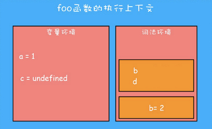

# 执行上下文、作用域、闭包

## 执行流程

⼀段 JavaScript 代码在执⾏之前需要被 JavaScript 引擎编译，编译完成之后，才会进⼊执⾏阶段。

## 编译

一段代码经过编译后会生成执行上下文(Execution Context)和可执行代码(Executable Code)

## 执行上下文

执行上下文（execution context，也称作执行环境）是 JavaScript 中最为重要的一个概念。执行上下文定义了变量或函数有权访问的其他数据，决定了它们各自的行为。执⾏上下⽂是 JavaScript 执⾏⼀段代码时的运⾏环境，⽐如调⽤⼀个函数，就会进⼊这个函数的执⾏上下⽂，确定该函数在执⾏期间⽤到的诸如 this、变量、对象以及函数等。

执行上下文一般有三种：

- 当 JavaScript 执⾏全局代码的时候，会编译全局代码并创建全局执⾏上下⽂，⽽且在整个⻚⾯的⽣存周期内，全局执⾏上下⽂只有⼀份。
- 当调⽤⼀个函数的时候，函数体内的代码会被编译，并创建函数执⾏上下⽂，⼀般情况下，函数执⾏结束之后，创建的函数执⾏上下⽂会被销毁。
- 当使⽤ eval 函数的时候，eval 的代码也会被编译，并创建执⾏上下⽂。

## 执行栈

每个函数都有自己的执行上下文。当执行流进入一个函数时，函数的执行上下文就会被推入一个环境栈中。而在函数执行之后，栈将其环境弹出，把控制权返回给之前的执行上下文。ECMAScript 程序中的执行流正是由这个方便的机制控制着。  
另外要注意，调用栈(执行栈)是有大小的，当⼊栈的执⾏上下⽂超过⼀定数⽬，JavaScript 引擎就会报错，我们把这种错误叫做栈溢出。在写递归函数时就会容易出现栈溢出的情况。

```js
function foo() {
  var a = 2;
  console.log(a);
}
var a = 1;
foo();
console.log(a);
```

执行栈是一个栈结构(FILO)，对于上面的代码，全局执行上下文首先被推入执行栈；然后执行到 foo 函数时，又将 foo 的执行上下文推入执行栈，控制权转到 foo 的执行上下文；foo 函数执行完后，执行栈将 foo 的执行上下文推出执行栈，将控制权交给全局执行上下文；最后全局上下文的代码执行完后，执行栈将全局上下文推出。

**执行上下文中存在变量环境(variable Environment)和词法环境(Lexical Environment)。**

## 变量环境

每个执行上下文都有一个与之关联的变量对象（variable object），执行上下文中定义通过 var 声明的变量作为一个属性保存在这个对象中并初始化属性的值为 undefined；对于函数声明，首先会在堆(HEAP)内存中创建函数，然后在变量对象中保存函数的同名属性，并将函数在堆内存的地址赋值给这个同名属性。虽然我们编写的代码无法访问这个对象，但解析器在处理数据时会在后台使用它。

## 词法环境

和变量环境类似，执行上下文中通过 `let` 或 `const` 声明的变量会保存在词法作用域中。  
词法环境也是一个栈结构，块级作用域与词法环境的的关系类似于执行上下文和执行栈的的关系。每执行到一个块级作用域词法环境就加入一个块级作用域，块级作用域的代码行完后，词法环境推出这个块级作用域。后面会具体说到的块级作用域即是通过词法环境来实现的。

> 1、注意区分执行上下文和作用域，块作用域和 `try...catch` 的 `catch` 部分都会有自己的作用域，但是他们不具有新的单独的执行上下文。即在当前执行上下文中会有多个作用域，比如在一个函数执行上下文中，除了有函数的作用域，块级作用域也是在当前执行上下文范围中的。  
> 2、函数只有在被执行时，才会对其内部代码进行编译，然后执行内部代码，其实这就是 js 通过执行栈控制执行流的机制。

## 变量提升

简单的说就是 js 代码在执行过程中，js 引擎把变量的声明部分和函数的声明部分提升到代码开头的“行为”。它是通过变量环境来实现的。

将前面的例子变一下：

```js
foo();
console.log(a);
function foo() {
  var a = 2;
  console.log(a);
}
var a = 1;
```

可以看到代码在声明变量 `a` 和函数 `foo` 之前就可以访问了。变量提升后，会给变量设置默认值 `undefined`，函数是直接提升，`let` 和 `const` 不能在他们声明变量之前访问，会报错，后面再详细讲。

变量提升看上去像是将变量提到了代码开头，其实不然。实际上在编译过程中，执行上下文会创建一个变量环境(即变量对象，variable object)。变量环境保存了变量提升的内容。在编译过程中，当执行到变量声明和函数声明时，对于变量，js 引擎在当前执行上下文到变量环境中创建名为 `a` 的属性，并对它进行初始化，赋值为 `undefined`；对于函数声明，首先会在堆(HEAP)内存中创建函数，然后在当前执行上下文到变量环境中创建名为 `foo` 的属性，`foo` 的值为刚才在堆内存中创建的函数的地址。

## 作用域

作用域是指在程序中定义的变量的区域，该位置决定了变量的声明周期。通俗的理解，作用域就是变量与函数的可访问范围，即作用域控制着变量和函数的可见性和生命周期。  
变量是在编译阶段，创建执行上下文后的就保存在执行上下文中的变量环境中了，所以作用域也是在编译阶段就已经确定下来的。  
可以简单的理解为一个执行上下文的变量环境就对应一个作用域。

在 ES6 之前，ES 的作用域只有 2 种：全局作用域和函数作用域。

## 块级作用域

ES6 新增了 `let` 和 `const` 命令，在代码块中，存在 `let` 和 `const` 命令时，代码块就成为块级作用域。  
前面分析了作用域的概念是通过执行上下文的变量环境来作为支撑的的，那么 ES6 是如何做到既要⽀持变量提升的特性，⼜要⽀持块级作⽤域的呢？下面从执行上下文的角度来进行分析：

### 词法环境与块级作用域

先看下面的代码

```js
function foo() {
  var a = 1;
  let b = 2;
  {
    let b = 3;
    var c = 4;
    let d = 5;
    console.log(a);
    console.log(b);
  }
  console.log(b);
  console.log(c);
  console.log(d);
}
foo();
```

1. 代码执行到 `foo` 函数后，先编译 `foo` 函数内的代码，并创建执行上下文。  
    变量环境初始化了所用通过 var 声明的变量 `a` 和 `c`，词法环境定义了变量 `b` 但是没有初始化。  
    函数内的块级作用域的代码，通过 `let` 声明的变量没有在词法环境定义。
   
2. 编译后开始执行代码，当执行到代码块中的代码时，变量环境中的 `a` 被赋值为 1，词法环境的 `b` 赋值为 2。  
   词法环境内维护了一个栈结构，进⼊⼀个作⽤域块后，就会把该作⽤域块内部的变量压到栈顶；当作⽤域执⾏完成之后，该作⽤域的信息就会从栈顶弹出，这就是词法环境的结构。  
   因此块级作用域的变量通过 `let` 声明的变量 `b` 和 `d` 被单独压入栈顶。  
   
3. 当执⾏到作⽤域块中的 `console.log(a)` 这⾏代码时，就需要在词法环境和变量环境中查找变量 `a` 的值了，具体查找⽅式是：沿着词法环境的栈顶向下查询，如果在词法环境中的某个块中查找到了，就直接返回给 JavaScript 引擎，如果没有查找到，那么继续在变量环境中查找。
   
4. 当作⽤域块执⾏结束之后，其内部定义的变量就会从词法环境的栈顶弹出.
   

## 作用域和作用域链

作用域和执行上下文容易搞混淆。下面用具体的例子来说明。

```js
function bar() {
  console.log(myName);
}
function foo() {
  var myName = 'foo';
  bar();
}
var myName = 'window';
foo();
```

你可能会有这样的误区，`foo` 函数中执行 `bar()` 时自然会向上查找 `myName` 变量，在 `foo` 函数的执行上下文中 `myName` 变量就是 `foo`。
然而实际上，上面的代码会输出 `window`。下面分析一下原因：

1. 基本概念：根据本篇的前面的内容，我们已经了解了执行上下文和执行栈，以及执行上下文中的变量环境和词法环境。
2. 查找规则：在某个执行上下文中查找变量，会先在当前执行上下文的词法环境中查找，找不到再在变量环境中查找，如果在当前执行上下文中也找不到，则访问父级的执行上下文，在父级的执行上下文中查找，这样一直向上查找直到全局执行上下文。
3. `foo` 函数执行到 `bar()` 时，首先访问了 `bar` 变量，但是在 `foo` 的执行上下文中没有 `bar` 变量，于是向上查找，在全局执行上下文中找到 `bar` 变量，是一个函数类型，然后执行 `bar()` 。
4. 然后关键点就在于，`bar` 是在全局执行上下文中的变量，是一个引用类型；`foo` 中的 `bar` 已经访问到了这个函数了，**变量的查找就结束了**，已经“拿到”这个函数了，接着是执行这个函数。
5. `foo` 函数中访问 `bar` 变量返回的是全局执行上下文中的 `bar` 的引用，`bar` 函数的执行，是全局执行上下文中的 `bar` 函数被执行了。接着创建 `bar` 的执行上下文，`bar` 的执行上下文进入执行栈。所以 `bar` 的执行上下文中访问 `myName` 变量时，首先在 bar 的执行上下文中没有找到，然后向父级执行上下文中查找。`bar` 的父级执行上下文是谁呢？这里又回到了第 2 步，向上查找，`bar` 的父级执行上下文就是全局执行上下文，所以 log 了 `window`。

虽然上面的解释不是很标准，但是重点在于分析过程。


### 作用域链

当代码在一个环境（执行上下文）中**执行**时，会创建变量对象的一个作用域链（scope chain）。作用域链的前端，始终都是当前执行的代码所在环境的变量对象（即当前执行上文所对应的作用域）。  
在当前执行上文又执行了新的函数，执行流进入到了新的函数的执行上下文时，这个新的函数所被定义在的作用域（链）的前端就添加了新的函数的执行上下文所对应的作用域，这样前后作用域形成的链条关系就是作用域链。从代码上看就是各个函数的包含关系。  
其中要注意的是：在当前环境又执行了新的函数，进入到了新的执行上下文时，如果新的函数本身不定义在当前作用域，那么当前作用域链前端不会添加新的函数的作用域，而是新的函数所在的作用域的前端添加新的函数的作用域。  
**我们回过头来看，执行上下文中的对变量的访问（函数执行也是先访问再执行），都是沿着作用域链一层一层向上查找的。**

> 当代码在一个环境中执行时，会创建变量对象的一个作用域链（scope chain）。作用域链的用途，是保证对执行上下文有权访问的所有变量和函数的有序访问。作用域链的前端，始终都是当前执行的代码所在环境的变量对象。如果这个环境是函数，则将其活动对象（activation object）作为变量对象。活动对象在最开始时只包含一个变量，即 `arguments` 对象（这个对象在全局环境中是不存在的）。作用域链中的下一个变量对象来自包含（外部）环境，而再下一个变量对象则来自下一个包含环境。这样，一直延续到全局执行上下文；全局执行上下文的变量对象始终都是作用域链中的最后一个对象。

> 标识符解析是沿着作用域链一级一级地搜索标识符的过程。搜索过程始终从作用域链的前端开始，然后逐级地向后回溯，直至找到标识符为止（如果找不到标识符，通常会导致错误发生）。

> 某个执行上下文中的所有代码执行完毕后，该环境被销毁，保存在其中的所有变量和函数定义也随之销毁（全局执行上下文直到应用程序退出——例如关闭网页或浏览器——时才会被销毁）。

### 总结

- 执行上下文：
  - 是编译过程中产生，编译完后（全局代码或者函数）就马上执行并保存在栈结构中。
  - 有全局执行上下文、函数执行上下文和 eval 的执行上下文。
- 作用域：
  - 当前执行上下文中变量定义并能产生作用的区域。他是一个概念上的东西。
  - 作用域在编译阶段就确定了，作用域的包含关系和代码的定义位置的包含关系一致。
  - 有全局作用域，函数作用域和块作用域（特殊），它在编译时的词法分析阶段就确定了，和函数怎么调用没关系。
- 作用域链：
  - 代码执行过程中执行流依次进入到各个执行上文时，这些执行上下文所对应的作用域被依次添加到最前面，而形成的作用域的链条关系。
  - 是代码中函数（定义的）位置的包含关系的体现。

## 区分执行上下文和作用域链

- 执行上下文是一个执行环境对象，它在代码执行流中按执行顺序被创建并通过栈结构保存和删除。
- 作用域和作用域链都是概念上的东西，他们反应了执行上下文中对变量或函数的访问及向上访问的行为或规则（在一定程度上也是代码结构的体现）。
- 执行上下文在执行栈中的顺序是代码执行的顺序，而作用域链的顺序是函数在代码中被定义的包含关系。他们的顺序结构也不一样。

## 闭包

在 JavaScript 中，根据词法作⽤域的规则，内部函数总是可以访问其外部函数中声明的变量，当通过调⽤⼀个外部函数返回⼀个内部函数后，即使该外部函数已经执⾏结束了，但是内部函数引⽤外部函数的变量依然保存在内存中，我们就把这些变量的集合称为闭包。⽐如外部函数是 foo，那么这些变量的集合就称为 foo 函数的闭包。

看一个例子：

```js
function foo() {
  var name = 'foo';
  return function baz() {
    console.log(name);
  };
}
var name = 'window';
var bar = foo();
bar();
```

1. 代码执行到 `foo` 函数 `return` 函数 `baz` 时，执行上下文中的情况如下：
   
2. 根据作用域链，`baz` 函数能够访问到外部函数 `foo` 的作用域中的变量 `name`，当 `foo` 函数执行结束推出执行栈时，全局变量 bar 保存了 `baz` 函 数，但是 `baz` 函数内能够访问到 `foo` 作用域的变量 `name`，所以这个变量依然保存在内存中，像是背包一样，无论 `baz` 在哪里被调用，都会带着这个 `foo` 的背包。
   
3. 当代码执行到 bar()时，访问了 `name` 变量，js 引擎会沿着“当前执行上下文-> foo 函数闭包 -> 全局执行上下文”的顺序来查找 `name` 变量
   

## 过期的闭包

过期的闭包或者说，闭包过期了。我也是在网上看到别人的文章了解到这一个概念，不过不知道是不是标准的叫法，因为分析过后，我觉得本质上根“过期”一词相关性不大。  
还是先来看一下所谓的过期的闭包是什么：

```js
function createIncrement(i) {
  let value = 0;
  function increment() {
    value += i;
    console.log(value);
    const message = `Current value is ${value}`;
    return function logValue() {
      console.log(message);
    };
  }
  return increment;
}

const inc = createIncrement(1);
const log = inc(); // 打印 1
inc(); // 打印 2
inc(); // 打印 3
// 没法正确工做
log(); // 打印 "Current value is 1"
```

代码中期望最后 log 时能够 log 出 3，但是还是 log 出 1。[网上文章](https://www.shangmayuan.com/a/27eea3068bf44f1eb5131f2a.html)把这一行为描述为过期的闭包导致的，也给出了解决办法。  
我个人觉得这种叫法不好，因为它掩盖了事情的本质！下面还是冲执行上下文和作用域链的角度来分析一下原因。

1. 代码执行到 `const inc = createIncrement(1)`时， `inc` 变量保存了 `createIncrement(1)`执行后返回的 `increment` 函数，且形成了一个 `createIncrement 函数的闭包`。
2. 代码执行到 `const log = inc()`时，`log` 变量保存了 `inc()`执行后返回的 `logValue` 函数，且形成了一个 `increment 函数的闭包`。
3. 代码执行到 `inc()`时，又重新执行了 `increment` 函数，返回了一个新的 `logValue` 函数，且形成了一个新的 `increment 函数的闭包`。但是没有作用域保存返回的函数，所以之后被垃圾回收。
4. 代码执行到 `inc()`时，又重新执行了 `increment` 函数，返回了一个新的 `logValue` 函数，且形成了一个新的 `increment 函数的闭包`。但是没有作用域保存返回的函数，所以之后被垃圾回收。
5. 代码执行到 `log()`时，根据作用域链，此时 `log` 变量保存的是第 2 步中返回的 `logValue` 函数，执行 `logValue` 函数后，进入 `logValue` 函数的执行上下文，它的内部访问了 `message` 变量，在当前 `logValue` 函数的执行上下文中没有找到，于是向上查找 `increment 闭包`，找到了。所以此时的作用域链为：“当前执行上下文 -> increment 函数闭包 -> createIncrement 函数闭包 -> 全局执行上下文”。

所以，最后的 log 的值为`“Current value is 1”`关键点在于：

1. 每次执行 `inc()`都返回了新的 `logValue` 函数，每个 `inc` 函数执行时都通过作用域链修改了 `createIncrement` 函数的闭包中的 `value` 值。
2. 每次执行 `inc()` ，都创建新的 `increment` 函数执行上下文，其中的 `message` 变量都是存在与各自的作用域中，它们是相互独立的。
3. 执行 `log()` 时，通过作用域链访问到到的是第一次调用 `inc()`时，`increment` 函数作用域中的 `message`，所以始终是`“Current value is 1”`，没有变。

因此，我觉得说闭包过期了并不合适，本质是在不同的作用域链中产生了多个不同的闭包，但是最终访问的是特定的闭包中的变量。说成过期，对于初次接触这个概念的人来说反而容易误导。
