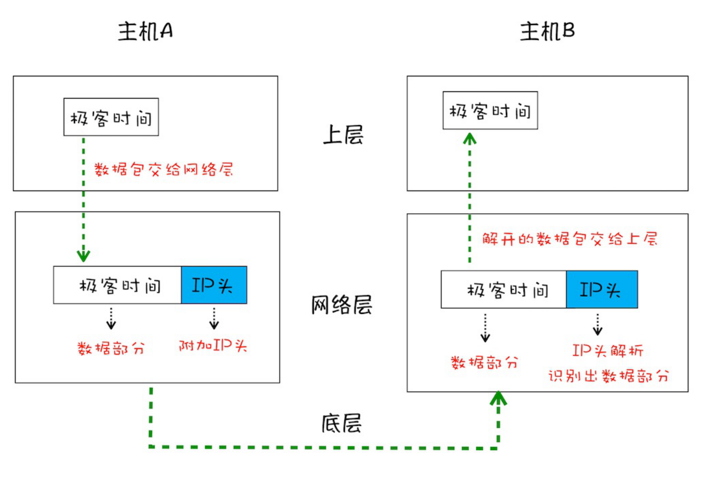
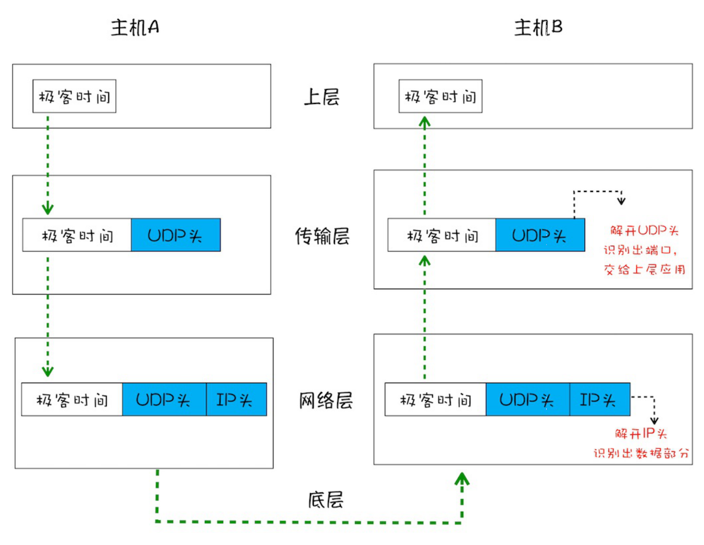
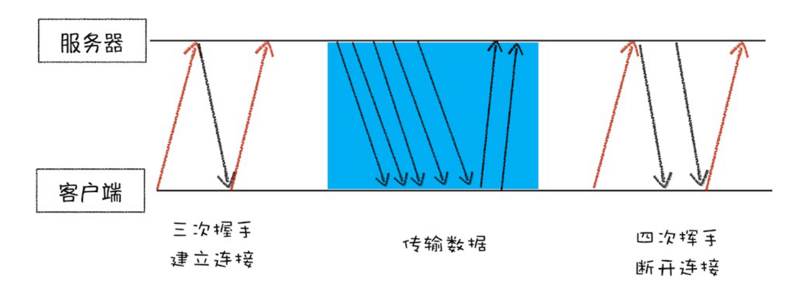

> 本文主要讲 Web 应用中的 TCP/IP 是如何工作的

# 数据包

互联⽹中的数据是通过数据包来传输的。如果发送的数据很⼤，那么该数据就会被拆分为很多⼩数据包来传输。⽐如我们平时听的⾳频数据，就是拆分成⼀个个⼩的数据包来传输的，并不是⼀个⼤的⽂件⼀次传输过来的。

# IP 地址，把数据包送达目的主机

IP（Internet Protocol）即网际协议。  
计算机的地址就称为 IP 地址，访问任何网站实际上只是你的计算机向另一台计算机请求信息。  
如果要想把⼀个数据包从主机 A 发送给主机 B，那么在传输之前，数据包上会被附加上主机 B 的 IP 地址信息， 这样在传输过程中才能正确寻址。额外地，数据包上还会附加上主机 A 本⾝的 IP 地址，有了这些信息主机 B 才可以回复信息给主机 A。这些附加的信息会被装进⼀个叫 IP 头的数据结构⾥。IP 头是 IP 数据包开头的信 息，包含 IP 版本、源 IP 地址、⽬标 IP 地址、⽣存时间等信息。

# UDP，把数据包送达应用程序

根据 IP 地址可以将数据包发送给目的主机，但是这个数据由那个程序使用并不能确定。因此，需要基于 IP 协议之上开发能和应用打交道的协议，最常见的是 **UDP**，即“**用户数据包协议**（User Datagram Protocol）”。  
UDP 中一个重要的信息是**端口号**，通过端⼝号 UDP 就能把指定的数据包发送给指定的程序了，所以**IP 通过 IP 地址信息把数据包发送给指定的电脑，⽽ UDP 通过端⼝号把数据包分发给正确的程序**。和 IP 头⼀样，端⼝号会被装进 UDP 头⾥⾯，UDP 头再和原始数据包合并组成新的 UDP 数据包。UDP 头中除了⽬的端⼝，还有源端⼝号等信息。

在使⽤ UDP 发送数据时，有各种因素会导致数据包出错，虽然 UDP 可以校验数据是否正确，但是对于错误的 数据包，UDP 并不提供重发机制，只是丢弃当前的包，⽽且 UDP 在发送之后也⽆法知道是否能达到⽬的地。  
虽说**UDP 不能保证数据可靠性，但是传输速度却⾮常快**，所以 UDP 会应⽤在⼀些关注速度、但不那么严格要求数据完整性的领域，如在线视频、互动游戏等。

# TCP，把数据完整地送达应用程序

对于浏览器请求，或者邮件这类要求数据传输可靠性（reliability）的应⽤，如果使⽤ UDP 来传输会存在**两个问题**：

- 数据包在传输过程中容易丢失
- ⼤⽂件会被拆分成很多⼩的数据包来传输，这些⼩的数据包会经过不同的路由，并在不同的时间到达接收 端，⽽ UDP 协议并不知道如何组装这些数据包，从⽽把这些数据包还原成完整的⽂件。

基于这两个问题，我们引⼊ TCP 了。TCP（Transmission Control Protocol，传输控制协议）是⼀种⾯向连接的、可靠的、基于字节流的传输层通信协议。相对于 UDP，TCP 有下⾯两个特点:

- 对于数据包丢失的情况，TCP 提供重传的机制
- TCP 引入了数据包排序机制，用来保证把乱序的数据包组合成完整的文件

和 UDP 一样，TCP 头除了包含目标端口和本机端口外，还提供了用于排序的序列号，以便接收端通过序号来重排数据包。  

下面再来看一个**完整的 TCP 链接过程**：

从图中可以看出，⼀个完整的 TCP 连接的⽣命周期包括了“**建⽴连接**”、“**传输数据**”和“**断开连接**”三个阶段。

- 建立链接阶段：指在建 ⽴⼀个 TCP 连接时，客⼾端和服务器总共要发送三个数据包以确认连接的建⽴，我们称之为**三次握⼿**。
- 传输数据阶段：在该阶段，**接收端需要对每个数据包进⾏确认操作**，也就是接收端在接收到数据包之后，需要发送确认数据包给发送端。所以当发送端发送了⼀个数据包之后，在规定时间内没有接收到接收端反馈的确认消息，则判断为数据包丢失，并触发发送端的重发机制。同样，⼀个⼤的⽂件在传输过程中会被拆分成很多⼩的数据包，这些数据包到达接收端后，接收端会按照 TCP 头中的序号为其排序，从⽽保证组成完整的数据。
- 断开链接阶段：数据传输完毕之后，就要终⽌连接了，涉及到最后⼀个阶段“四次挥⼿”来保证双⽅都能断开连接。
  1. TCP 客户端发送一个 FIN，用来关闭客户到服务器的数据传送。
  2. 服务器收到这个 FIN，它发回一个 ACK，确认序号为收到的序号加 1。和 SYN 一样，一个 FIN 将占用一个序号。
  3. 服务器关闭客户端的连接，发送一个 FIN 给客户端。
  4. 客户端发回 ACK 报文确认，并将确认序号设置为收到序号加 1。

**为什么需要三次握手，两次不行吗？**
第一次握手：客户端发送网络包，服务端收到了。  
这样服务端就能得出结论：客户端的发送能力、服务端的接收能力是正常的。  
第二次握手：服务端发包，客户端收到了。  
这样客户端就能得出结论：服务端的接收、发送能力，客户端的接收、发送能力是正常的。不过此时服务器并不能确认客户端的接收能力是否正常。  
第三次握手：客户端发包，服务端收到了。  
这样服务端就能得出结论：客户端的接收、发送能力正常，服务器自己的发送、接收能力也正常。

**挥手为什么需要四次？**  
因为当服务端收到客户端的 SYN 连接请求报文后，可以直接发送 SYN+ACK 报文。其中 ACK 报文是用来应答的，SYN 报文是用来同步的。但是关闭连接时，当服务端收到 FIN 报文时，很可能并不会立即关闭 SOCKET，所以只能先回复一个 ACK 报文，告诉客户端，“你发的 FIN 报文我收到了”。只有等到我服务端所有的报文都发送完了，我才能发送 FIN 报文，因此不能一起发送。故需要四次挥手。

# 总结

- 网路中的数据通过数据包来传输，数据包在传输的过程中容易丢失或出错。
- IP 负责把数据包送达目的主机。
- UDP 负责把数据包送达目的应用。
- 而 TCP 保证了数据完整传输，它的链接分为三个阶段：建立链接、传输数据、断开链接。
